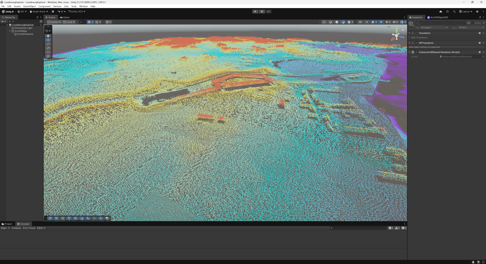

# Louisbourg Archaeological LiDAR Explorer

An interactive 3D GIS project exploring the archaeological landscape of
the Fortress of Louisbourg National Historic Site, Nova Scotia, using
airborne LiDAR, ArcGIS Pro, and the ArcGIS Maps SDK for Unity.

## Project Overview

The project develops an end-to-end 3D geospatial workflow from raw
airborne LiDAR through GIS processing, quality assurance, scene-layer
generation, and interactive visualization in Unity.

The study area includes the reconstructed Fortress of Louisbourg and
its surrounding archaeological landscape.

The project is designed to demonstrate practical experience with:

- LiDAR and point-cloud QA/QC
- LAS classification and editing
- coordinate and vertical reference systems
- terrain generation
- ArcGIS 3D scene workflows
- I3S / Point Cloud Scene Layers
- ArcGIS Maps SDK for Unity
- 3D GIS application development

## Technology

- ArcGIS Pro
- ArcGIS 3D Analyst
- ArcGIS Maps SDK for Unity
- Unity
- C#
- Python / ArcPy
- Git / GitHub

## Data Sources

### LiDAR

Government of Nova Scotia provincial LiDAR.

Initial source dataset:

- Acquisition year: 2018
- Source format: LAZ
- Source tiles: 12
- Source point count: 239,229,210
- Horizontal reference: NAD 1983 (CSRS) UTM Zone 20N
- Vertical reference: CGVD2013

Original source classifications included:

- Class 2 — Ground
- Class 3 — Low Vegetation
- Class 4 — Medium Vegetation
- Class 5 — High Vegetation
- Class 9 — Water
- Class 17 — Bridge Deck

### Orthophotography

Nova Scotia Orthophotomap Database (NSODB).

Current imagery over the study area was acquired in 2024 and is used for:

- LiDAR QA/QC
- building and feature validation
- spatial alignment checks
- planned RGB point-cloud colorization

The 2024 orthophoto tile covering the primary project area is:

`1045850059900`

The imagery postdates the LiDAR acquisition by six years. This temporal
difference will be retained in the project metadata and considered during
RGB colorization and QA.

### Transportation

The Nova Scotia Road Network (NSRN) was reviewed as an authoritative
transportation reference within the study area.

The network generally aligned with the 2024 orthophotography, although
some road and path geometry differed from current visible conditions.

## LiDAR QA/QC

Initial inspection identified apparent classification anomalies within
the reconstructed fortress.

Several non-vegetated building surfaces had been classified as medium or
high vegetation. Building footprints were digitized using orthophotography,
LiDAR elevation structure, and visual interpretation as independent
reference information.

Because the original compressed LAZ files could not be edited directly,
the project AOI was extracted to uncompressed LAS working files. Confirmed
building returns were then selectively reclassified to:

**LAS Class 6 — Building**

Grass-covered fortification surfaces, including portions of the King's
Bastion, were intentionally excluded from blanket building
reclassification because the actual LiDAR returns represent vegetation
even where the vegetation forms part of a built heritage structure.

This preserves the distinction between:

- the physical surface represented by a LiDAR return; and
- the semantic meaning of the archaeological feature.

Road and walkway areas were also reviewed against the NSRN,
orthophotography, and point cloud. Most transportation surfaces within
the site are unpaved dirt or cleared ground and were already classified
as:

**LAS Class 2 — Ground**

Because this classification accurately represents the measured surface,
no road-surface reclassification was applied.

The QA/QC workflow therefore prioritizes correction only where the source
classification is demonstrably inconsistent with the observed surface.

## Terrain Processing

A focused project Area of Interest was extracted from the original
provincial LiDAR coverage.

Ground-classified returns were used to generate a:

**1 metre bare-earth Digital Elevation Model**

The DEM provides a terrain surface independent of buildings and
vegetation and will support later terrain visualization and Unity
elevation integration.

## Coordinate System and Scene Preparation

The source LiDAR uses:

- NAD 1983 (CSRS) UTM Zone 20N for horizontal coordinates
- CGVD2013 for elevations

During Point Cloud Scene Layer preparation, the source vertical
coordinate system required an explicit recognized definition for scene
layer generation.

A scene-ready LAS Dataset was therefore created using:

- Horizontal CRS: NAD 1983 (CSRS) UTM Zone 20N — WKID 2961
- Vertical CRS: CGVD2013(CGG2013) height — WKID 6647

The underlying point coordinates were not transformed. The explicit
spatial-reference definition was added so the scene-layer workflow could
correctly validate the relationship between horizontal and vertical
units.

## Point Cloud Scene Layer

The processed LiDAR was packaged in ArcGIS Pro as a local Point Cloud
Scene Layer Package (`.slpk`).

Cached point attributes include:

- classification code
- intensity
- return information

The resulting scene layer was validated in an ArcGIS Pro Local Scene
before being transferred to Unity.

Large generated scene packages and source geospatial datasets are not
stored in the Git repository.

## ArcGIS Maps SDK for Unity

The Point Cloud Scene Layer was successfully integrated into Unity using
the ArcGIS Maps SDK for Unity.

The Unity scene currently uses:

- a Local ArcGIS Map
- the same projected spatial reference as the source GIS data
- a local Point Cloud Scene Layer Package
- an ArcGIS-aware camera
- no external basemap or online elevation dependency

The initial integration confirmed that the processed Louisbourg point
cloud can be rendered at its real-world scale and location directly from
the ArcGIS scene-layer workflow.

This establishes the working pipeline:

Raw LAZ  
→ LAS Dataset  
→ QA/QC and classification correction  
→ AOI extraction  
→ bare-earth terrain  
→ Point Cloud Scene Layer  
→ ArcGIS Maps SDK for Unity

## Project Structure

    gis/
        ArcGIS Pro project and supporting GIS configuration

    unity/
        Unity application

    scripts/
        Python / ArcPy utilities

    data/
        raw/
        staging/
        processed/

    outputs/
        maps/
        screenshots/
        video/
        web/

    docs/
        workflow/
        figures/
        portfolio/

    references/
        metadata/
        historic_maps/

Large source and derived geospatial datasets are intentionally excluded
from version control.

## Current Status

### Completed

- Project and repository setup
- 2018 provincial LiDAR acquisition
- LAS Dataset creation and initial QA/QC
- Focused archaeological AOI definition
- AOI extraction
- Conversion from LAZ to editable LAS
- Building-footprint digitization
- Selective building reclassification to LAS Class 6
- Road and walkway classification review
- 2024 orthophoto integration for QA/QC
- 1 m bare-earth DEM generation
- Scene-ready horizontal and vertical CRS preparation
- Point Cloud Scene Layer Package generation
- ArcGIS Pro Local Scene validation
- Successful ArcGIS Maps SDK for Unity integration
- Local Unity camera and projected map configuration

### In Progress

- Acquisition of 2024 orthophoto GeoTIFF
- RGB LiDAR colorization
- Local terrain integration in Unity

### Planned

- Final RGB Point Cloud Scene Layer
- Unity terrain/elevation surface
- navigation and camera controls
- analytical layer and visualization controls
- project UI and interaction design
- public-facing project demonstration
- technical workflow documentation

## Goal

The final application will provide an interactive 3D exploration of
Louisbourg using measured LiDAR, derived terrain, and contextual GIS
data.

The project demonstrates a workflow spanning source-data QA/QC,
coordinate-system management, point-cloud processing, terrain modelling,
3D GIS delivery, and custom Unity application development.
